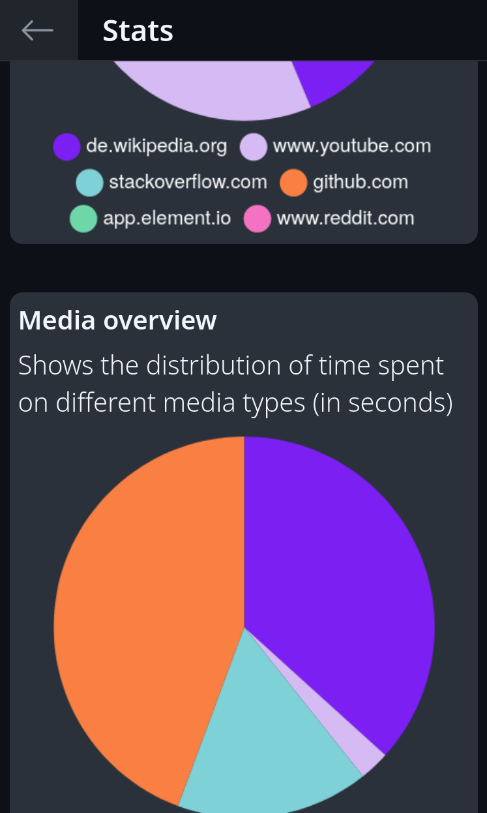

# Firefox-TimeUsage

This is a simple browser addon for Firefox to see the time you spent per day in your browser and also on which sites.

**Note: The project is just beginning and is not yet fully functional!**

---

**Table of contents:**  

[1. Current Features](#1-current-features)  
[2. Planned functions](#2-planned-functions)  
[3. Installing](#3-installing-from-source)  
[4. Contact](#4-contact)  

## 1. Current Features

  

*Example picture of the Addon-Popup*

What are the **current features**:

- Viewing the amount of time you spent on each website
- Edge list of websites by highest to lowest usage time
- Displaying the total time spent today
- Display of the number of pages used
- Delete/Reset value (website) from list
- Add value from the list to an ignore list. This means that it is deleted from the list and the time for this website is no longer counted.

  

*Example of the options menu for individual entries*

## 2. Planned functions

- Visualize statistics in diagrams
- Create settings page for useful options for the user
- Send push message when reaching optional time limit

## 3. Installing from source

1. Press `Ctrl` + `Shift` + `A` or go via Menu to AddOn & Theme tab of the Firefox-Settings
2. Go to **Extensions** (1)
3. Click the **Gear-Symbol** (2) and go to **Debug Add-ons** (3)

4. Click **Load Temporary Add-on** and select `manifest.json` from downloaded repository in your file-system

## 4. Contact

If you find a bug, have a question, or have a feature request, feel free to contact me.

E-Mail: ninja.zero@seznam.cz  
Discord: Ice Warrior#1274
