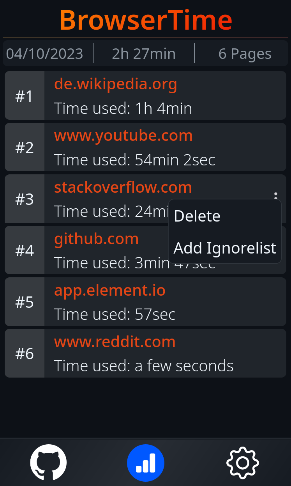

# Firefox-TimeUsage

This is a simple browser addon for Firefox to see the time you spent per day in your browser and also on which sites.

**Currently, it's just starting out and not really functional!**

## Current Features

  
*Example picture of the Addon-Popup*

What are the current features:

- Viewing the amount of time you spent on each website
- Edge list of websites by highest to lowest usage time
- Displaying the total time spent today
- Display of the number of pages used

## Planned functions

- Delete a single entry from the list
- Add website to ignore list -> exclude from counting
- Visualize statistics in diagrams
- Send push message when reaching optional time limit

## Installing from source

1. Press `Ctrl` + `Shift` + `A` or go via Menu to AddOn & Theme tab of the Firefox-Settings
2. Go to **Extensions** (1)
3. Click the **Gear-Symbol** (2) and go to **Debug Add-ons** (3)

4. Click **Load Temporary Add-on** and select `manifest.json` from downloaded repository in your file-system

## Contact

If you find a bug, have a question, or have a feature request, feel free to contact me.

E-Mail: ninja.zero@seznam.cz  
Discord: Ice Warrior#1274
